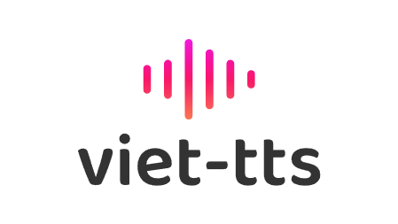

<p align="center">
  
  <h1 align="center" style="color: white; font-weight: bold; font-family:roboto"><span style="color: white; font-weight: bold; font-family:roboto">VietTTS</span>: Công cụ chuyển văn bản thành giọng nói tiếng Việt mã nguồn mở</h1>
</p>
<p align="center">
    <a href="https://github.com/dangvansam/viet-tts"></a>
    <a href="https://huggingface.co/dangvansam/viet-tts"></a>
    <a href="https://huggingface.co/dangvansam/viet-tts"></a>
    <a href="https://github.com/dangvansam/viet-tts"></a>
    <!-- <a href="https://pypi.org/project/viet-tts" target="_blank"> -->
    <a href="LICENSE"></a>
    <br>
    <a href="./README.md"></a>
    <a href="./README_VN.md"></a>
</p>

**VietTTS** là một bộ công cụ mã nguồn mở cung cấp mô hình TTS tiếng Việt mạnh mẽ, cho phép tổng hợp giọng nói tự nhiên và tạo giọng nói mới. **VietTTS** hỗ trợ nghiên cứu và ứng dụng trong công nghệ giọng nói tiếng Việt.

## ⭐ Tính năng nổi bật
- **TTS**: Tổng hợp giọng nói từ văn bản với bất kỳ giọng nào qua audio mẫu
- **VC**: Chuyển đổi giọng nói (TODO)

## 🛠️ Cài đặt
VietTTS có thể cài đặt qua trình cài đặt Python hoặc Docker.

### Trình cài đặt Python

```bash
git clone https://github.com/dangvansam/viet-tts.git
cd viet-tts

# (Tùy chọn) Tạo môi trường Python với conda hoặc dùng virtualenv
conda create --name viettts python=3.10
conda activate viettts

# Cài đặt
pip install -e . && pip cache purge
```

### Docker
1. Cài đặt [Docker](https://docs.docker.com/get-docker/), [NVIDIA Driver](https://www.nvidia.com/download/index.aspx), [NVIDIA Container Toolkit](https://docs.nvidia.com/datacenter/cloud-native/container-toolkit/install-guide.html), và [CUDA](https://developer.nvidia.com/cuda-downloads).

2. Chạy các lệnh sau:
```bash
git clone https://github.com/dangvansam/viet-tts.git
cd viet-tts

# Xây dựng hình ảnh docker
docker compose build

# Chạy bằng docker-compose - tạo server tại: http://localhost:8298
docker compose up -d

# Chạy bằng docker run - tạo server tại: http://localhost:8298
docker run -itd --gpu=alls -p 8298:8298 -v ./pretrained-models:/app/pretrained-models -n viet-tts-service viet-tts:latest viettts server --host 0.0.0.0 --port 8298

# Hiển thị danh sách giọng nói sẵn có
docker exec viet-tts-service viettts show-voices
```

## 🚀 Sử dụng

### Giọng nói tích hợp 🤠
Bạn có thể sử dụng các giọng nói có sẵn dưới đây để tổng hợp giọng nói.
<details>
  <summary>Mở rộng</summary>

| ID  | Giọng                   | Giới tính | Phát âm thanh                                   |
|-----|--------------------------|-----------|-------------------------------------------------|
| 1   | nsnd-le-chuc             | 👨        | <audio controls src="samples/nsnd-le-chuc.mp3"></audio> |
| 2   | speechify_10             | 👩        | <audio controls src="samples/speechify_10.wav"></audio> |
| 3   | atuan                    | 👨        | <audio controls src="samples/atuan.wav"></audio>        |
| 4   | speechify_11             | 👩        | <audio controls src="samples/speechify_11.wav"></audio> |
| 5   | cdteam                   | 👨        | <audio controls src="samples/cdteam.wav"></audio>       |
| 6   | speechify_12             | 👩        | <audio controls src="samples/speechify_12.wav"></audio> |
| 7   | cross_lingual_prompt     | 👩        | <audio controls src="samples/cross_lingual_prompt.wav"></audio> |
| 8   | speechify_2              | 👩        | <audio controls src="samples/speechify_2.wav"></audio>   |
| 9   | diep-chi                 | 👨        | <audio controls src="samples/diep-chi.wav"></audio>      |
| 10  | speechify_3              | 👩        | <audio controls src="samples/speechify_3.wav"></audio>   |
| 11  | doremon                  | 👨        | <audio controls src="samples/doremon.mp3"></audio>       |
| 12  | speechify_4              | 👩        | <audio controls src="samples/speechify_4.wav"></audio>   |
| 13  | jack-sparrow             | 👨        | <audio controls src="samples/jack-sparrow.mp3"></audio> |
| 14  | speechify_5              | 👩        | <audio controls src="samples/speechify_5.wav"></audio>   |
| 15  | nguyen-ngoc-ngan         | 👩        | <audio controls src="samples/nguyen-ngoc-ngan.wav"></audio> |
| 16  | speechify_6              | 👩        | <audio controls src="samples/speechify_6.wav"></audio>   |
| 17  | nu-nhe-nhang             | 👩        | <audio controls src="samples/nu-nhe-nhang.wav"></audio> |
| 18  | speechify_7              | 👩        | <audio controls src="samples/speechify_7.wav"></audio>   |
| 19  | quynh                    | 👩        | <audio controls src="samples/quynh.wav"></audio>         |
| 20  | speechify_8              | 👩        | <audio controls src="samples/speechify_8.wav"></audio>   |
| 21  | speechify_9              | 👩        | <audio controls src="samples/speechify_9.wav"></audio>   |
| 22  | son-tung-mtp             | 👨        | <audio controls src="samples/son-tung-mtp.wav"></audio> |
| 23  | zero_shot_prompt         | 👩        | <audio controls src="samples/zero_shot_prompt.wav"></audio> |
| 24  | speechify_1              | 👩        | <audio controls src="samples/speechify_1.wav"></audio>   |

  <div>

  </div>

</details>

### Thực thi với lệnh (CLI)

Giao diện dòng lệnh VietTTS cho phép bạn tạo giọng nói từ terminal. Cách sử dụng:

```bash
# Hướng dẫn sử dụng
viettts --help

# Khởi động API Server
viettts server --host 0.0.0.0 --port 8298

# Tổng hợp giọng nói từ văn bản
viettts synthesis --text "Xin chào" --voice 0 --output test.wav

# Liệt kê tất cả các giọng nói có sẵn
viettts show-voices
```

### API Client
#### Python (OpenAI Client)
Thiết lập biến môi trường cho OpenAI Client:

```bash
# Thiết lập base_url và API key như biến môi trường
export OPENAI_BASE_URL=http://localhost:8298
export OPENAI_API_KEY=viet-tts # không dùng trong phiên bản hiện tại
```

Để tạo giọng nói từ văn bản đầu vào:

```python
from pathlib import Path
from openai import OpenAI


client = OpenAI()
output_file_path = Path(__file__).parent / "speech.wav"

with client.audio.speech.with_streaming_response.create(
    model='tts-1',
    voice='cdteam',
    input='Xin chào Việt Nam.',
    speed=1.0,
    response_format='wav'
) as response:
    response.stream_to_file('a.wav')
```

#### CURL
```bash
curl http://localhost:8298/v1/audio/speech \
  -H "Authorization: Bearer viet-tts" \
  -H "Content-Type: application/json" \
  -d '{
    "model": "tts-1",
    "input": "Xin chào Việt Nam.",
    "voice": "son-tung-mtp"
  }' \
  --output speech.wav
```

#### Node
```js
import fs from "fs";
import path from "path";
import OpenAI from "openai";

const openai = new OpenAI();
const speechFile = path.resolve("./speech.wav");

async function main() {
  const mp3 = await openai.audio.speech.create({
    model: "tts-1",
    voice: "1",
    input: "Xin chào Việt Nam.",
  });
  console.log(speechFile);
  const buffer = Buffer.from(await mp3.arrayBuffer());
  await fs.promises.writeFile(speechFile, buffer);
}
main();
```

## 🙏 Mã liên quan
- 💡 Sử dụng mã từ [Cosyvoice](https://github.com/FunAudioLLM/CosyVoice)
- 🎙️ Mô hình VAD từ [silero-vad](https://github.com/snakers4/silero-vad)
- 📝 Chuẩn hóa văn bản với [Vinorm](https://github.com/v-nhandt21/Vinorm)

## 📜 Giấy phép
Mã nguồn của **VietTTS** được cấp phép theo **Apache 2.0 License**. Mô hình và mẫu âm thanh huấn luyện được cấp phép theo **CC BY-NC License**, dựa trên tập dữ liệu từ internet. Xin lỗi nếu điều này gây bất tiện.

## ⚠️ Tuyên bố miễn trừ trách nhiệm
Nội dung trên chỉ phục vụ mục đích học thuật và nhằm trình bày khả năng kỹ thuật. Một số ví dụ lấy từ internet. Nếu nội dung vi phạm quyền của bạn, vui lòng liên hệ để được gỡ bỏ.

## 💬 Liên hệ 
- Facebook: https://fb.com/sam.rngd
- GitHub: https://github.com/dangvansam
- Email: dangvansam98@gmail.com